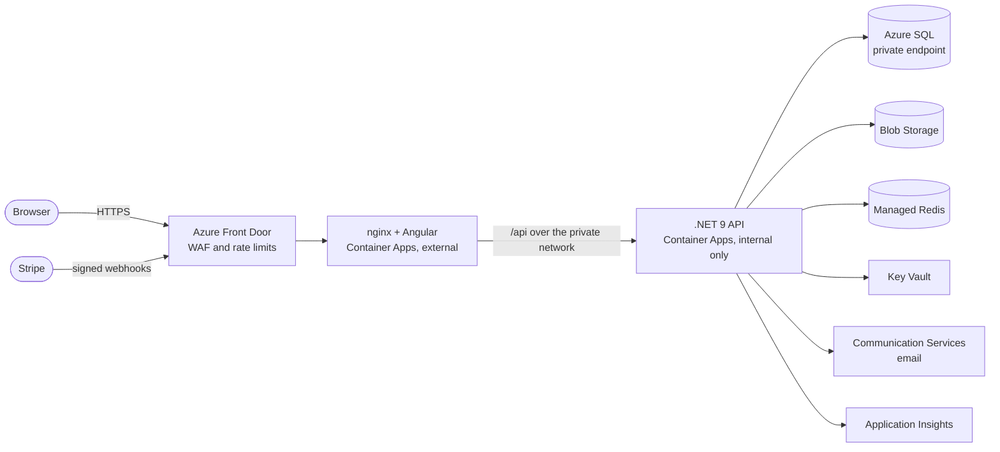

# KnowledgeMarket

[](https://github.com/NoahStarkenburg/knowledge-market/actions/workflows/ci.yml)

A course marketplace where creators publish courses and learners buy and watch them.
Built as a .NET 9 REST API with an Angular 21 single-page frontend, running on Azure.

**Live demo:** <https://knowledgemarket-bbedacandbcbajbu.z01.azurefd.net>

Create an account to browse. Payments run in Stripe test mode: card `4242 4242 4242 4242`,
any future date, any CVC. The database is on Azure SQL's free serverless tier, which pauses
when idle, so the first request after a quiet period can take up to a minute while it wakes.

## Highlights

- **Live on Azure, all infrastructure as code.** Terraform provisions Front Door with a WAF
  (rate limits on the whole site and tighter ones on sign-in), Container Apps inside a VNet,
  Azure SQL over a private endpoint, Blob Storage, Managed Redis, Key Vault, Communication
  Services email and Application Insights. The API has no public address, and nginx only
  accepts traffic that came through Front Door.
- **No passwords in the app.** SQL, Blob Storage, Redis, email and Key Vault are all reached
  with managed identities. Stripe keys live in Key Vault and are referenced by name, and the
  secrets Terraform generates never enter its state file.
- **Payments that can't charge twice.** Stripe PaymentIntents, an idempotency key per buyer
  backed by a unique index, and signed webhooks with idempotent fulfilment.
- **Careful auth.** JWT in an HttpOnly cookie, a CSRF double-submit token, rotating refresh
  tokens with a single-flight refresh in the Angular interceptor, email verification, and
  role- and resource-based authorization.
- **Tested against the real thing.** 119 backend tests, including 77 integration tests that
  boot the real API against a SQL Server 2022 container with Testcontainers, plus 39 frontend
  tests. CI runs all of them on every pull request.
- **Built for a serverless database.** A connection retry policy and a 90-second connect
  timeout ride out Azure SQL's auto-pause, and the API refuses to start in Production with
  missing or placeholder configuration.

## How it runs in production



Everything in the diagram is defined in [`infra/`](infra) (Terraform). Each image is built
once per commit, tagged with the commit SHA, pushed to Azure Container Registry and rolled
out to Container Apps; Terraform deliberately ignores the running image so an apply never
rolls a deployment back. GitHub Actions builds and tests every pull request. Automated
deployment through QA and staging to production, with approval gates, is the next step.

## Stack

| Layer | Technology |
|---|---|
| API | .NET 9, ASP.NET Core (minimal APIs + controllers) |
| Data | SQL Server 2022, Entity Framework Core (per-schema migrations) |
| Auth | JWT in an HttpOnly cookie, CSRF double-submit token, role-based policies |
| Cache | Redis (optional; no-op when unconfigured), Azure Managed Redis with Entra ID in Azure |
| Payments | Stripe (one-time and subscription, webhook-driven fulfilment) |
| Storage | Pluggable: local filesystem, S3-compatible, or Azure Blob Storage |
| Frontend | Angular 21 (standalone components, signals), TypeScript, Tailwind CSS |
| Tests | xUnit with Testcontainers (backend), Vitest through the Angular CLI (frontend) |
| Infrastructure | Terraform on Azure: Front Door, Container Apps, Azure SQL, Blob Storage, Managed Redis, Key Vault, Communication Services, Application Insights |
| CI | GitHub Actions: backend build and tests, frontend lint, build and tests |

## Running it locally

**Prerequisites:** [.NET 9 SDK](https://dotnet.microsoft.com/download),
[Node.js 20+](https://nodejs.org), and [Docker Desktop](https://docker.com/products/docker-desktop).

**1. Start the database.**

```bash
docker compose up -d
docker compose ps        # wait until mssql is "healthy"
```

Docker runs the *dependencies*. The app itself runs on your machine, so you keep
the debugger and hot reload.

**2. Start the API.**

```bash
cd src/Api
dotnet run
```

Serves on <http://localhost:5116>, applies EF Core migrations on startup, and
exposes Swagger at `/swagger`.

**3. Start the frontend.**

```bash
cd src/frontend
npm ci
npm start
```

Serves on <http://localhost:4200> and forwards `/api` to the API, so the browser
sees one origin.

**4. Seed sample data (optional).**


```bash
CSRF=$(curl -s -X POST http://localhost:5116/api/auth/login \
  -H "Content-Type: application/json" \
  -d '{"email":"admin@knowledgemarket.local","password":"DevAdmin@LocalOnly!"}' \
  -c cookies.txt | jq -r .csrf)

curl -X POST http://localhost:5116/api/dev/bulk-seed -b cookies.txt -H "X-CSRF: $CSRF"
```

The API requires a CSRF token on unsafe methods, so seeding needs a login first.
Generates courses, lessons, and users. Available in Development only.

Sign in with `admin@knowledgemarket.local` / `DevAdmin@LocalOnly!` (from
`appsettings.Development.json`, local use only).

## Configuration and secrets

**No real credential is committed to this repository, and none ever should be.**

Configuration is layered. Later sources override earlier ones:

```
appsettings.json                -> shape and safe defaults, committed
appsettings.Development.json    -> local-only values, committed
dotnet user-secrets             -> your real local secrets, NOT committed
environment variables           -> production values, NOT committed
```

### What is safe to commit, and what is not

The question is never "does it look like a password?" but **what does this value
protect, and who can reach it?**

Safe to commit:

- The local SQL Server password in `docker-compose.yml`. It protects a container
  bound to your own machine, created from that same file. Anyone who can read it
  could already start an identical container.
- Issuer and audience names, bucket names, feature flags, ports, URLs.
- The Azurite account key in `docker-compose.yml`, which Microsoft publishes and
  every Azurite install shares.

Never commit:

- `Jwt:SigningKey`. Anyone holding it can mint valid tokens for any user.
- `Stripe:SecretKey`, `Stripe:WebhookSecret`.
- Real SMTP credentials, OAuth client secrets, cloud access keys.
- Any production connection string.

### Setting local secrets

Secrets live in .NET user-secrets, stored outside this folder at
`%APPDATA%\Microsoft\UserSecrets\<UserSecretsId>\secrets.json`. They are not
encrypted; they are simply somewhere git cannot see. That is the whole point.

```bash
cd src/Api
dotnet user-secrets set "Jwt:SigningKey" "$(openssl rand -base64 48)"
dotnet user-secrets set "Stripe:SecretKey" "sk_test_..."
dotnet user-secrets set "Stripe:WebhookSecret" "whsec_..."
dotnet user-secrets list
```

The app runs without any of these using the Development defaults. Stripe is off
by default (`Stripe:Disabled: true`); set the keys above and flip it to `false`
to enable payments.

### Frontend values are public

The frontend takes four build-time values: `STRIPE_PUBLISHABLE_KEY`,
`GOOGLE_AUTH`, `GOOGLE_CLIENT_ID` and `GOOGLE_API_KEY`. The Angular compiler
**writes them into the JavaScript bundle** that ships to the browser, where anyone
can read them, so there is no way to hide a value there.

Only publishable identifiers belong in the frontend: a Stripe publishable key, an
OAuth client ID. Defaults live under `define` in `src/frontend/angular.json`, and
the Docker image takes real values as build arguments. See
[src/frontend/README.md](src/frontend/README.md).

### In production

Every secret arrives as an environment variable, using `__` for nesting
(`Jwt__SigningKey`, `Stripe__SecretKey`). `ProductionConfigValidator` refuses to
start the app if any required value is missing, too short, or still contains
placeholder text, so a misconfigured deployment fails immediately and loudly
rather than running insecurely.

## Testing

```bash
dotnet test                          # 119 backend tests (Docker must be running)
cd src/frontend && npm test          # 39 frontend tests
cd src/frontend && npm run lint
```

## Architecture

Clean Architecture: **dependencies point inward**, toward the domain.

```
Api  ->  Application  ->  Domain
              ^
        Infrastructure
```

- **Domain.\***: entities and rules, one project per bounded context. References nothing.
- **Application**: use cases. Declares what it needs as interfaces (ports) in
  `Abstractions/`, and knows nothing about EF Core or HTTP.
- **Infrastructure**: implements those ports with EF Core repositories and the S3,
  SMTP, Stripe and Redis adapters.
- **Api**: HTTP only, plus the composition root that wires ports to adapters.
- **Shared.Kernel / Shared.Abstractions**: cross-cutting types (`Money`,
  `PagedResult`) and platform ports (`IStorage`, `ICacheStore`) that belong to no
  single context.

The inversion is what makes `Application` testable without a database, which is
why the unit tests run in milliseconds.

There are five bounded contexts (Catalog, Orders, Identity, Content, Cart),
each with its own `DbContext` and its own SQL schema with a separate migration
history. Six repositories still join across those schemas, so the contexts are
not yet independently deployable; breaking those joins is what extracting any of
them into a service would require. Module-per-project was deliberately not
adopted: at this size it would be ceremony without payoff.

See [docs/architecture.md](docs/architecture.md) for detail, plus
[docs/redis-caching.md](docs/redis-caching.md) and
[docs/google-integration.md](docs/google-integration.md).

## Project structure

```
.github/workflows/ci.yml    CI: build and test on every pull request
docs/                       Architecture and feature documentation
infra/                      Terraform for the Azure deployment
src/
  Api/                      HTTP: controllers, auth endpoints, composition root
  Application/              Use cases and the ports they depend on
  Infrastructure/           EF Core, plus S3 / SMTP / Stripe / Redis adapters
  Domain.Cart/              Cart aggregate
  Domain.Catalog/           Courses and reviews
  Domain.Content/           Lessons and lesson assets
  Domain.Identity/          Users, roles, authentication
  Domain.Orders/            Orders, subscriptions, enrolment
  Domain.Contracts/         Request and response DTOs
  Shared/
    Shared.Kernel/          Money, PagedResult, exceptions, diagnostics
    Shared.Abstractions/    IStorage, IContentStorage, ICacheStore
  frontend/                 Angular SPA
tests/
  UnitTests/                Domain and service unit tests
  IntegrationTests/         Full HTTP tests against a real SQL Server container
```

## License

[MIT](LICENSE)
