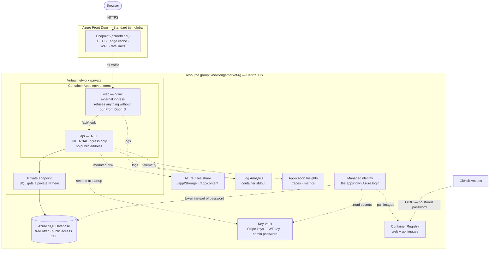
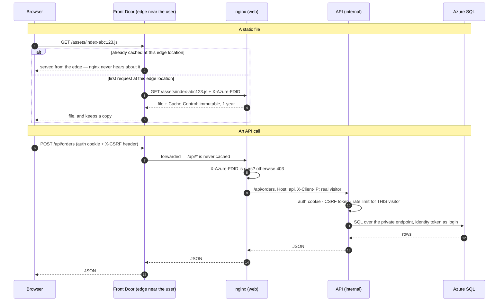
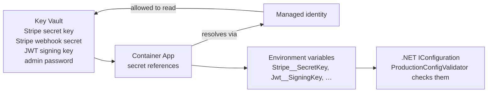
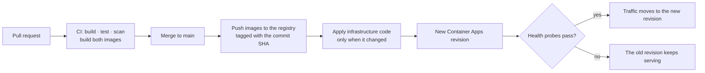

# Phase 9: Deployment

## Goal

knowledge-market running publicly on Azure, with every resource defined in
code, deployed by a pipeline, and understood well enough that you can explain
every box in the diagram below — what it does, why it exists, and what you
would remove first to save money.

## Why it matters

"I deployed it" is common. "I can draw the architecture, explain every security
boundary, tear it down and rebuild it with one command, and ship a change
through a pipeline" is not. That second sentence is the portfolio artifact.

The diagrams render on GitHub. The rest of the document explains them one piece
at a time.

---

## The whole picture



Three things to notice before anything else:

1. **One arrow in from the internet.** Everything enters through Front Door.
2. **The API and the database have no public address.** They are only
   reachable from inside the private network.
3. **The dotted lines carry no passwords.** Registry pulls, secret reads and the
   database login all use the managed identity, and GitHub deploys with OIDC.

---

## How a request actually travels



Every step in the API call is something already built and tested in phase 5:
the Front Door ID check, the `Host` header, `X-Client-IP`, the rate limits keyed
on the real visitor, `SameSite=Lax` and the CSRF token.

---

## Every resource: what it does and why it is there

Costs are rough monthly figures for this traffic level. Check the Azure pricing
calculator before relying on them; prices move.

| Resource | In plain terms | Why we need it | On your laptop | Rough cost |
|---|---|---|---|---|
| **Resource group** | a folder holding everything | delete the folder and everything goes with it | — | free |
| **Front Door profile + endpoint** | the global front door: HTTPS, caching, routing | static files fast everywhere; attacks stopped before they reach Azure | nginx plays this role | ~$35 base |
| **WAF policy** | rules that block bad requests | custom rules and rate limits at the edge | — | ~$5 + per rule |
| **Virtual network + subnets** | a private network | lets the database exist with no public address | compose networks | ~free |
| **Container Apps environment** | the shared place both containers run, with its own DNS and router | internal ingress, scaling, revisions | the compose project | free |
| **web** Container App | nginx serving the SPA | the one origin Front Door talks to | compose `web` | free allowance |
| **api** Container App | the .NET API | internal ingress keeps it private | compose `api` | free allowance; one warm replica costs a little |
| **Azure SQL** server + database | SQL Server, run by Microsoft | backups, patching, point-in-time restore | compose `mssql` | $0 on the free offer |
| **Private endpoint + private DNS zone** | a private IP for SQL inside the network, plus DNS so the normal hostname resolves to it | public network access to SQL can be switched off entirely | the `data` network | ~$8 |
| **Key Vault** | a locked box for secrets | secrets never live in images, git or pipeline logs | .NET user-secrets | cents |
| **Managed identity** | an Azure login that belongs to the app | no passwords for the registry, Key Vault or SQL | your own login | free |
| **Storage account + Azure Files** | a network disk | uploads and lesson text survive restarts and scale-to-zero | named volumes | cents |
| **Container Registry** | stores the built images | Container Apps pulls from it | your local image store | ~$5 |
| **Log Analytics workspace** | where container logs land, queryable | production logs from day one | `docker compose logs` | free under 5 GB |
| **Application Insights** | request, dependency and error charts | see what production is doing | nothing yet — Grafana in phase 8 | mostly free at this volume |
| **Budget** | an email when spend crosses $50 | no surprise bill | — | free, already created |

Total with Front Door: roughly **$45–50/month**. Without Front Door and with the
cheaper switches below: roughly **$0**.

---

## The security boundaries, from outside in

Each layer assumes the one outside it has already failed. That is what defense
in depth means in practice.

| # | Boundary | What it stops |
|---|---|---|
| 1 | **Front Door WAF and rate limits** | malicious payloads and floods, before they cost you compute |
| 2 | **nginx checks `X-Azure-FDID`** | anyone who finds the container's address and tries to skip layer 1 |
| 3 | **API internal ingress** | any direct connection to the API from outside the environment |
| 4 | **SQL public access off + private endpoint** | any connection to the database from outside the network |
| 5 | **Managed identity** | leaked passwords — there are none to leak |
| 6 | **The app itself** | auth cookie, `SameSite=Lax`, CSRF token, per-visitor rate limits, account lockout |

---

## How secrets reach the app



The app code does not know Key Vault exists. It reads configuration exactly as it
does locally; only where the values come from changes. Non-secret settings — the
public URL, `ForwardedHeaders__Enabled`, the nginx upstream — are plain
environment variables.

The JWT signing key and admin password are **generated directly into Key
Vault**, never typed or printed. The Stripe keys are copied from your
user-secrets without being displayed.

---

## How a deploy happens



Two properties worth being able to explain:

- **Images are tagged with the commit SHA, never `latest`.** You always know
  exactly which code is running, and rolling back means pointing at an older tag.
- **A new revision only takes traffic once its probes pass.** A broken deploy
  does not take the site down; the previous revision keeps serving.

---

## Infrastructure as code: why at all

Everything above could be created by clicking through the Azure portal. Teams
don't, because clicking has no memory:

- nobody can review a click before it happens
- there is no history of what changed or why
- rebuilding the environment means remembering forty screens in the right order
- dev, staging and production drift apart without anyone noticing
- "what does production actually contain?" has no definitive answer

**Infrastructure as code** puts the architecture in git. It is reviewed in pull
requests like application code, and one command builds it, changes it, or
deletes it.

## Terraform, Bicep, and the rest

| | Portal clicks | `az` CLI scripts | ARM JSON | **Bicep** | **Terraform** | Pulumi |
|---|---|---|---|---|---|---|
| Reproducible | no | mostly | yes | yes | yes | yes |
| Readable diff in a PR | no | poor | poor | good | good | good |
| Preview changes before applying | no | no | what-if | `what-if` | `plan` | `preview` |
| Works beyond Azure | — | no | no | **no** | **yes** — AWS, GCP, Cloudflare, GitHub… | yes |
| State file to manage | no | no | no | **no** — Azure is the record | **yes** | yes |
| Support for brand-new Azure features | day one | day one | day one | day one | usually soon after | follows Terraform's provider |
| Language | clicks | shell | verbose JSON | small Azure-specific language | HCL | C#, TypeScript, Python… |
| How often it appears in job postings | — | — | rarely | in Microsoft-centric shops | **very often** | occasionally |

### Bicep

Microsoft's language for Azure. It compiles down to ARM templates, which is what
Azure understands natively.

- **No state file.** Azure itself is the source of truth: Bicep describes what
  should exist, and Azure works out the difference.
- New Azure features are available the day they ship.
- Simple, and fully supported by Microsoft.
- **Azure only.** Nothing you learn transfers to AWS or GCP.

### Terraform

HashiCorp's tool, with providers for almost every cloud and many SaaS products.

- **Keeps a state file**: a record of every resource it created and its current
  settings. `terraform plan` compares your code against that state and against
  reality, and shows the exact diff before `apply` changes anything.
- **The same workflow works on AWS, GCP, Cloudflare, GitHub**, which is a large
  part of why it appears in so many job postings.
- The state file is itself a real skill to learn: it must be stored remotely
  (so CI and other people use the same one), locked during changes (so two
  applies can't collide), and protected, because it **contains secrets in
  plaintext**. Storing it means creating a storage account *before* Terraform can
  manage anything else — a chicken-and-egg bootstrap step worth understanding.
- Licensing note: Terraform moved to a source-available licence in 2023, and
  **OpenTofu** is the open-source fork. Same language, same workflow.

### Pulumi

Infrastructure written in real programming languages — including C#, which is
appealing for a .NET developer. Less common in job postings than either of the
above.

### The honest summary

Both Bicep and Terraform are professional, correct choices for this project, and
the architecture is identical either way. The difference is what you are
optimising for:

- **Bicep** if the priority is the simplest path on Azure specifically.
- **Terraform** if the priority is a skill that transfers across clouds and shows
  up in most job descriptions, at the cost of learning state management.

---

## Switches for going cheaper later

| Switch | Full configuration | All-free configuration |
|---|---|---|
| Front Door | on (~$35) | off — nginx gets the public address directly |
| Database networking | private endpoint (~$8) | SQL firewall rules instead |
| Image registry | Azure Container Registry (~$5) | GitHub Container Registry (free) |
| API minimum replicas | 1 — always warm | 0 — scales to zero, slower first request |
| SQL | free offer | free offer |

Changing tier is editing a variable and re-applying. No application code changes.

---

## Tasks

1. **Infrastructure code** for everything except Front Door, with the switches
   above.
2. **First deploy by hand**, fixing whatever Azure raises.
3. **Front Door and the WAF**, then set `FRONT_DOOR_ID` on the web app.
4. **GitHub Actions**: build both images on every PR; deploy on merge using OIDC.
5. **Launch**: seed realistic content, register a new Stripe test webhook for the
   live URL and delete the old endpoint, smoke test, add the link to the README.
6. **Google sign-in**, shipped through the pipeline.

## Verify

```bash
# everything that exists, in one place
az resource list -g knowledgemarket-rg -o table

# the API has no public hostname
az containerapp show -g knowledgemarket-rg -n knowledgemarket-api \
  --query "properties.configuration.ingress.external"        # false

# the database refuses public connections
az sql server show -g knowledgemarket-rg -n <server> \
  --query publicNetworkAccess                                # "Disabled"

# Front Door is caching the hashed assets (look for a cache HIT on a repeat request)
curl -sI https://<endpoint>.azurefd.net/assets/<file>.js | grep -i x-cache

# the web container refuses requests that skip Front Door
curl -s -o /dev/null -w '%{http_code}' https://<web-app-fqdn>/    # 403
```

## Questions

1. Name the six security boundaries from the outside in, and what each one stops.
2. Why does nginx exist in Azure when Front Door already caches and routes?
3. The API has no public address. How does a browser's API call reach it?
4. What would break if nginx forwarded the public hostname as `Host` instead of
   the API's own name?
5. Why is the JWT signing key generated straight into Key Vault instead of being
   copied from your laptop?
6. What is a managed identity, and which three passwords does it replace here?
7. Why are images tagged with the commit SHA instead of `latest`?
8. A deploy's health probes fail. What do users see, and why?
9. What is a Terraform state file, why must it be stored remotely and locked, and
   why must it be kept private?
10. Why does Bicep not need a state file?
11. Which three switches would you flip first to cut the monthly cost to about
    zero, and what does each one cost you in return?
